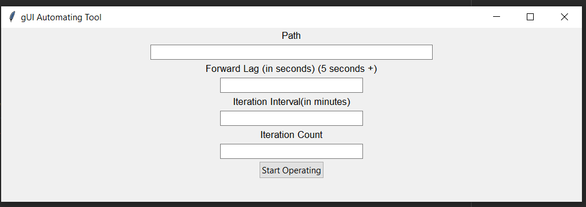

# GUI-Automation-Tool-GAT
Python based GUI automation tool to do tedious repetitive tasks automatically, uses Tkinter and pyautogui.

🛠️GUI Automation Tool🛠️

## GUIDE
In the path Enter the coordinates to click, to assist you with this you can find the coordinates using this [tool](www.google.com).
### Forward lag: 
FOrward lag is how long to wait after a click. Default is 5 seconds, you can leave it blank as well.
### Iteration Interval: 
Time interval to repeat the coordinates click after once finished.
### Iteration Count: 
Number of times to repeat (Default is 1) 
